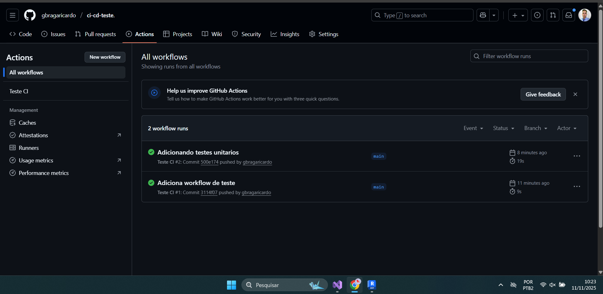

## O que é CI/CD e por que é importante?
CI/CD significa Integração Contínua e Entrega/Implantação Contínua. É a prática de automatizar os processos de build, teste e deploy de software. É importante porque permite entregar software aos usuários mais rápido, com mais frequência e reduzindo erros (risco).

## Em qual pasta os workflows do GitHub ficam armazenados?
Os workflows do GitHub ficam armazenados no diretório .github/workflows, localizado na raiz do repositório.

## O que aparece no log do GitHub Actions após a execução?
log exibe o status (sucesso ou falha) de todo o workflow, detalhes da execução de cada job e passo (step), mostrando os comandos executados, as saídas de scripts e mensagens de erro ou aviso.

## O que acontece se alterar o código e fizer novo push?
o GitHub Actions é acionado automaticamente, iniciando uma nova execução de workflow para testar as alterações "commitadas" no repositório.

## O que acontece se um teste falhar?
A execução do workflow é interrompida, o status final é marcado como failed.

## Como o GitHub Actions ajuda a detectar erros cedo?
O GitHub Actions ajuda a detectar erros cedo ao executar automaticamente testes e análises de código imediatamente após cada push. Isso garante que o código problemático não se integre ao projeto principal.

## Quais seriam exemplos reais de CI/CD em projetos web ou mobile?
Exemplo mobile: O pipeline é acionado, compila o código para Android ou iOS, executa testes automatizados, e se for bem-sucedido, gera os arquivos final.

## Como o deploy automático poderia ser feito a partir deste pipeline?
O deploy automático é feito no pipeline usando uma etapa final configurada para usar chaves criptografadas para se conectar ao servidor (web, nuvem) e copiar o código final para o ambiente de destino, como azure ou aws.

Prints das Actions:

